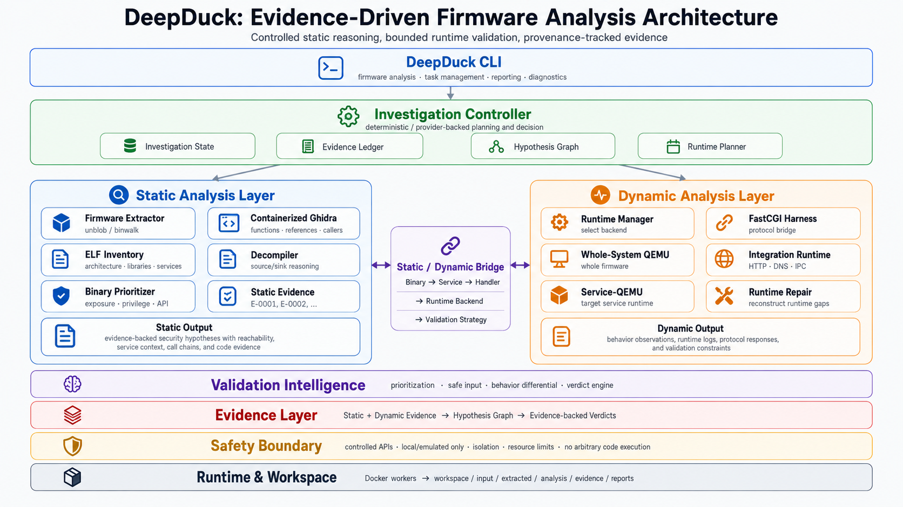
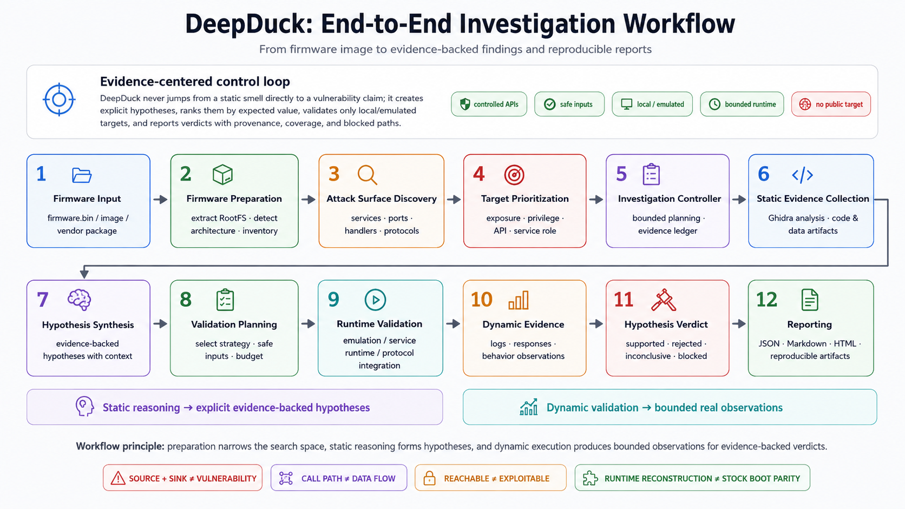

# DeepDuck

[](https://www.python.org/)
[](https://www.docker.com/)
[](pyproject.toml)
[](https://arxiv.org/abs/xxxx.xxxxx)
[](#reports)

**🦆 Deep Exploration and Evaluation Platform for Device Understanding, Correlation, and Knowledge.**

DeepDuck is an automated evidence-driven firmware security analysis agent. It combines firmware extraction, canonical root filesystem validation, real headless binary analysis, cross-component evidence correlation, bounded runtime validation, and provider-backed investigation under deterministic safety and budget controls.

DeepDuck does not generate exploits, does not probe public targets, and does not manufacture vulnerability findings when evidence is insufficient.

## 🧭 Overview

DeepDuck turns a firmware image into a reproducible analysis workspace while keeping static reasoning, runtime observations, and final claims explicitly separated.

<p align="center">
  
</p>

<p align="center">
  <sub><b>Figure 1.</b> DeepDuck evidence-driven firmware analysis architecture.</sub>
</p>

Provider-backed investigation is a planning and decision layer. The provider sees registered structured tools through DeepDuck's controller; it does not receive arbitrary shell, Docker, QEMU, or process-execution tools.

## ✨ Key Features

- Firmware extraction with Docker/binwalk-backed root filesystem recovery, including legacy LZMA SquashFS recovery via `sasquatch`.
- Canonical RootFS validation, ELF inventory, architecture detection, and task workspace management.
- Binary prioritization for high-value static targets.
- Containerized Ghidra analysis with generated function/import/export artifacts.
- Component graph construction and attack-surface modeling.
- Evidence-backed source/sink correlation for security-relevant context.
- Deterministic hypothesis synthesis, validation prioritization, and bounded investigation loops.
- Safe runtime reconstruction for selected service/application validation paths.
- FastCGI/service validation with provenance-tracked DynamicEvidence records.
- Provider-backed investigation with structured output and controlled tool calling.
- JSON, Markdown, and local/offline HTML reports.
- Resume, status, cleanup, and explicit report-regeneration commands.

## 🔄 Analysis Workflow

DeepDuck follows an evidence-centered investigation workflow. Firmware preparation narrows the search space, static analysis produces explicit evidence-backed hypotheses, and bounded dynamic validation collects real observations before a hypothesis can influence a final finding.

<p align="center">
  
</p>

<p align="center">
  <sub><b>Figure 2.</b> DeepDuck end-to-end investigation workflow.</sub>
</p>

The workflow is intentionally conservative: reachability is not treated as exploitability, a source and sink do not automatically establish data flow, and runtime reconstruction is not presented as proof of stock vendor boot parity.

## 🚀 Quick Start

### 📦 Requirements

- Python 3.10 or newer.
- Docker Engine-compatible runtime.
- Tested environment: Windows 10/11 with Docker Desktop.
- Host Ghidra is not required for the default containerized deep-static backend.
- Host Java 21 is not required for the default containerized deep-static backend.

### 🛠️ Installation

DeepDuck is not documented here as a PyPI package. Install from the repository:

```bash
git clone https://github.com/HokagoTeaT1me/DeepDuck.git
cd DeepDuck
python -m pip install -e .
```

The user-facing console command is `deepduck`. The Python package name remains `fwagent` internally for compatibility.

### 🔍 Analyze Firmware

```bash
deepduck analyze firmware.bin
```

By default, DeepDuck creates a task under `workspace/` and generates reports under `workspace/<task-id>/reports/`.

Advanced example:

```bash
deepduck analyze firmware.bin --workspace workspace --task-id my-analysis --timeout 1200 --report-format json,md,html
```

### 📊 Status and Reports

```bash
deepduck status my-analysis --workspace workspace
deepduck report my-analysis --workspace workspace --format json,md,html
```

Developer fallback:

```bash
python -m fwagent.cli analyze firmware.bin --workspace workspace --task-id my-analysis
```

## 🤖 Provider-Backed Investigation

Provider integration is optional. Deterministic analysis can run without provider credentials; provider-backed commands require a configured model API.

DeepDuck reads provider configuration from environment variables or a local `.env` file. Required variable names:

```text
MODEL_PROVIDER
MODEL_NAME
MODEL_API_KEY
MODEL_BASE_URL
```

Compatibility aliases are also supported:

```text
FWAGENT_MODEL_PROVIDER
FWAGENT_MODEL_NAME
FWAGENT_MODEL_API_KEY
FWAGENT_MODEL_BASE_URL
```

`.env` is ignored by Git and Docker builds. Do not put API keys in reports, prompts, commits, or issue text.

Provider diagnostics:

```bash
deepduck model-doctor --connect
deepduck model-smoke
```

Provider-backed validation smoke:

```bash
deepduck agent-smoke my-analysis H-PROVIDER-SMOKE --workspace workspace
```

Current v0.1 provider acceptance validates **bounded provider-backed execution**. The accepted smoke run terminated at the configured controller step budget (`max_steps`), not through an autonomous convergence decision.

## 🛡️ Safety and Evidence Model

DeepDuck is intentionally conservative:

- Analyze local and authorized firmware only.
- Do not probe public targets.
- Do not expose arbitrary shell, Docker, QEMU, or process execution to the provider.
- Do not generate exploit payloads.
- Keep dynamic validation bounded by request, tool-call, runtime, and loopback controls.
- Track evidence provenance and runtime-observation status.
- Exclude mock, simulated, blocked, and inconclusive attempts from canonical real-runtime confirmation.

Interpretation rules:

- `SOURCE + SINK != VULNERABILITY`
- `CALL PATH != DATA FLOW`
- `REACHABLE != EXPLOITABLE`
- `HTTP 500 != VULNERABILITY`
- `RUNTIME RECONSTRUCTION != STOCK BOOT PARITY`

## 📄 Reports

Each analysis task can generate:

| Artifact | Path |
|---|---|
| JSON report | `workspace/<task-id>/reports/report.json` |
| Markdown report | `workspace/<task-id>/reports/report.md` |
| HTML report | `workspace/<task-id>/reports/report.html` |
| Report manifest | `workspace/<task-id>/reports/report_manifest.json` |
| Pipeline summary | `workspace/<task-id>/pipeline_summary.json` |
| Pipeline stages | `workspace/<task-id>/pipeline_stages.json` |
| Extraction record | `workspace/<task-id>/artifacts/extraction.json` |
| Canonical rootfs record | `workspace/<task-id>/artifacts/rootfs.json` |
| Ghidra summary | `workspace/<task-id>/ghidra/analysis_summary.json` |
| Dynamic evidence | `workspace/<task-id>/dynamic/evidence/evidence.json` |
| Findings | `workspace/<task-id>/findings/findings.json` |

The HTML report is a local/offline artifact, not a Web UI.

## ✅ Validated Example

Latest local real-firmware acceptance used a TP-Link SR20 firmware image:

```text
tpra_sr20v1_us-up-ver1-2-1-P522_20180518-rel77140_2018-05-21_08.42.04.bin
```

Observed results:

| Metric | Result |
|---|---|
| Extraction backend | Docker/binwalk |
| RootFS files | 2255 |
| ELF binaries | 457 |
| Architecture | ARM 32-bit little-endian |
| Real Dockerized Ghidra | 20 / 20 |
| Ghidra fallback | 0 |
| Runtime path | Selected FastCGI integration |
| Real runtime observations | 4 |
| Findings | 0 |

The selected FastCGI validation reached the application and observed an HTTP 500 SOAP fault for an unknown SOAP action. That response is application behavior for the safe probe and is not a vulnerability claim.

DeepDuck does not treat `Findings: 0` as a failed run. It means no vulnerability was promoted from the available canonical evidence.

## 🧪 v0.1 Acceptance Status

Current status:

`DEEPDUCK V0.1 REAL DYNAMIC + REAL PROVIDER ACCEPTED / MULTI-FIRMWARE ACCEPTANCE PARTIAL`

| Capability | Status |
|---|---|
| Fresh extraction | PASS |
| Canonical RootFS | PASS |
| Real Dockerized Ghidra | PASS |
| Cross-component correlation | PASS |
| Safe real dynamic runtime | PASS |
| Canonical runtime evidence | PASS |
| Provider-backed Agent | PASS |
| Structured output | PASS |
| Controlled tool calling | PASS |
| ARM real firmware | PASS |
| MIPS architecture fixture | PASS |
| Unsupported input handling | PASS |
| Additional real firmware extraction/static reports | PARTIAL |
| Multi-firmware real acceptance | PARTIAL |

Release candidate compatibility validation remains pending for full real Ghidra and runtime/provider acceptance across a second distinct authorized real firmware image. DeepDuck v0.1 is therefore not documented as RC-ready.

## 🧩 Validated Samples

| Sample Class | Status | Notes |
|---|---|---|
| TP-Link SR20 real firmware | PASS | Real extraction, Ghidra, selected dynamic runtime, provider acceptance |
| D-Link DIR-815 real firmware | PARTIAL | Legacy SquashFS/LZMA extraction via `sasquatch`, MIPS little-endian inventory and reports; real Ghidra/runtime validation partial |
| Huawei HG532e real firmware | PARTIAL | Big-endian SquashFS/LZMA extraction via `sasquatch`, MIPS big-endian inventory and reports; real Ghidra/runtime validation partial |
| MIPS architecture fixture | PASS | Fixture integration coverage only |
| Opaque unsupported sample | PASS | Graceful partial handling, no crash |

## ⚠️ Known Limitations

1. Full real dynamic/provider acceptance currently includes only one distinct real firmware image; additional real firmware images have extraction/static reports only.
2. Dynamic validation has been demonstrated on the selected FastCGI path, not every firmware service.
3. Runtime repair establishes reconstructed reachability, not original vendor boot-sequence parity.
4. Source/sink correlation is evidence-oriented and does not imply vulnerability confirmation.
5. Provider-backed execution is bounded by deterministic controller budgets.
6. Whole-firmware emulation is not guaranteed for every image.

## 🧰 Development and Testing

Run the full test suite:

```bash
python -m unittest discover -v
```

Environment-gated real dynamic/provider acceptance tests are available for configured local workspaces:

```powershell
$env:DEEPDUCK_RUN_REAL_DYNAMIC_TESTS='1'
$env:DEEPDUCK_RUN_REAL_PROVIDER_TESTS='1'
python -m unittest tests.integration.test_v01_real_dynamic_provider_acceptance -v
```

Build the default containerized Ghidra/extraction worker:

```bash
docker build -t fwagent-round2:latest .
```

The container includes `binwalk`, `unblob`, `unsquashfs`, and `sasquatch` so legacy SquashFS 3.x/4.x LZMA firmware images can be recovered by the default Docker extraction path.

`fwagent-round2:latest` and `fwagent-round3-dynamic:latest` are internal implementation image names retained for reproducibility metadata; DeepDuck is the product name.

## 📁 Project Layout

```text
DeepDuck/
  assets/
    architecture.png
    workflow.png
  fwagent/        # Internal Python package
  config/         # Ghidra and dynamic validation configuration
  ghidra_scripts/ # Containerized Ghidra export helpers
  tests/          # Unit and integration tests
  workspace/      # Generated task workspaces, ignored by Git
  reports/        # Local generated reports, ignored by Git
```

## 📜 License

This project is configured as MIT in `pyproject.toml`.
